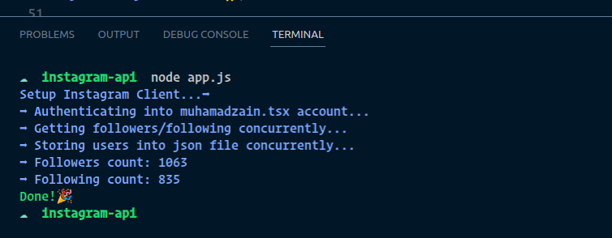
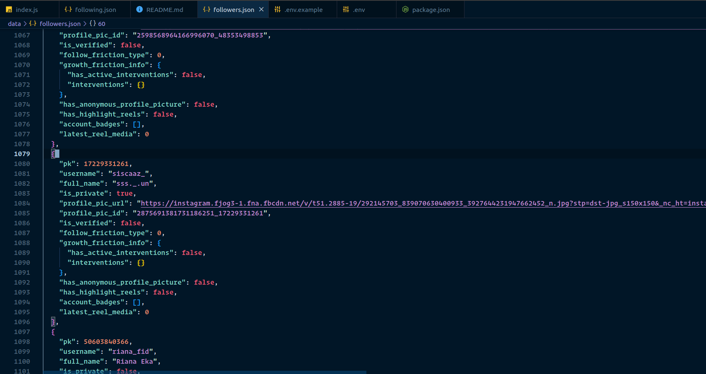

## instagram Private Api Checker

## Getting Started

- Clone this Projects

```bash
git clone https://github.com/Zainal21/instagram-private-api-checker.git
```

- Rename to _.env_ from _.env.example_

```bash
rename .env.example to .env and set your IG_USERNAME, IG_PASSWORD
```

- Install Dependencies

```bash
 yarn Install or npm Install
```

- Install Dependencies

```bash
 yarn Install or npm Install
```

- Run Projects

```bash
node app.js
```

## Example Result




## Credits

Built with [Instagram-private-api](https://www.npmjs.com/package/instagram-private-api), [chalk](https://www.npmjs.com/package/chalk), and [dotenv](https://www.npmjs.com/package/dotenv). Created by [Muhamadzain.tsx](https://instagram.com/muhamadzain.tsx)
